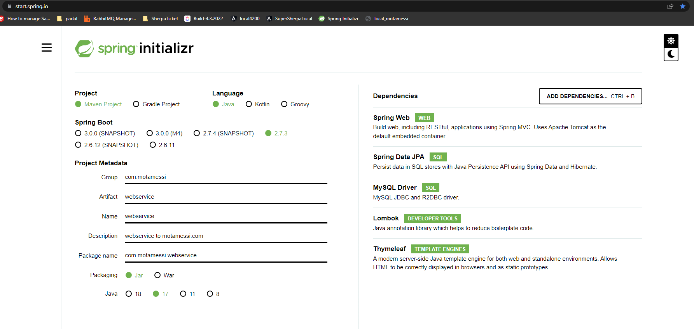
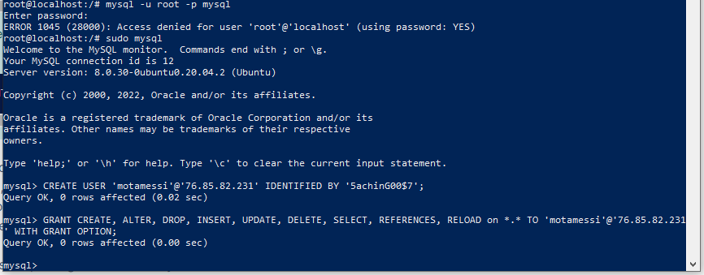

# Set up shorcut keys
>>   
# Setting up string boot rest api app
>>Download spring boot rest api template from https://start.spring.io/
Extract All, Open intellj and open the mvnw file inside \initial.
If error with getting dependency to go File-->settings-->build execution deployment-->Maven and set the the maven home path to the downloaded and extracted maven template root <br>
  
<br>Oepn application.properties file and add server.port=54366. If that port is in use by other app in you local keep adding one to it until you get a successfull run.
<br>  
<br>To rename module, right click on the project folder
<br>  

# Connecting to mysql database
<br> Add dependency in pom.xml
```xml
<dependency>
    <groupId>mysql</groupId>
    <artifactId>mysql-connector-java</artifactId>
    <scope>runtime</scope>
</dependency>
```
<br>  
# ...

# Createing new spring project
>> Go to https://start.spring.io/
<br> Keep all defaults except the project metatdata, modify according to your needs.
<br> Add depencies as in the picture ( do some research what they are for)
<br>  
<br>Click Generate to download the project template.

# Setting up mysql
>><br>To enable this, open up your mysqld.cnf file:
<br>sudo nano /etc/mysql/mysql.conf.d/mysqld.cnf
<br>Navigate to the line that begins with the bind-address directive. It will look like this:
<br>/etc/mysql/mysql.conf.d/mysqld.cnf
<br>lc-messages-dir = /usr/share/mysql
<br>skip-external-locking
<br>Instead of skip-networking the default is now to listen only on localhost which is more compatible and is not less secure.
<br>bind-address = 127.0.0.1
<br>Note: In certain versions of MySQL the bind-address directive may not be in the mysqld.cnf file by default. <br>In this case, add the following highlighted line to the bottom of the file:w
<br>/etc/mysql/mysql.conf.d/mysqld.cnf
<br>[mysqld]
<br>pid-file        = /var/run/mysqld/mysqld.pid
<br>socket          = /var/run/mysqld/mysqld.sock
<br>datadir         = /var/lib/mysql
<br>log-error       = /var/log/mysql/error.log
<br>bind-address            = 0.0.0.0
<br> Run 
<br>sudo systemctl restart mysql
<br>switch to mysql Run,
<br>sudo mysql or mysql -u root -p
<br><h3>Create remote user</h3> 
Run following command in the mysql terminal:<br>
CREATE USER 'motamessi'@'76.85.82.231' IDENTIFIED BY '5achinG00$7';
GRANT CREATE, ALTER, DROP, INSERT, UPDATE, DELETE, SELECT, REFERENCES, RELOAD on *.* TO 'motamessi'@'76.85.82.231' WITH GRANT OPTION;
<br>Example
  
<br>For sachin, create motamessi@(his_public_IP_address)
<br>Also allow ufw 
<br>sudo ufw allow from remote_IP_address to any port 3306
<br>OR
<br>sudo ufw allow 3306
