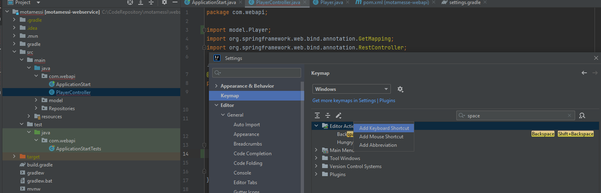
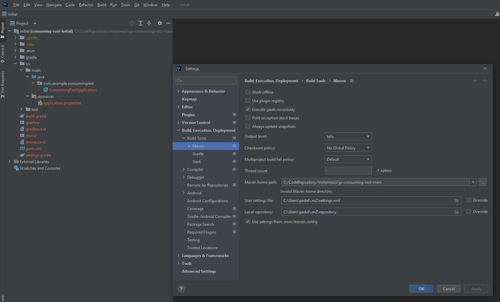
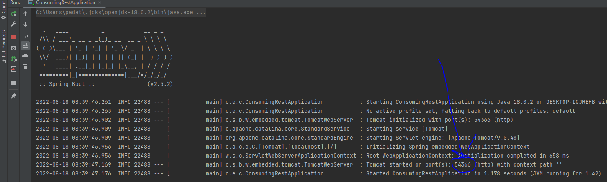
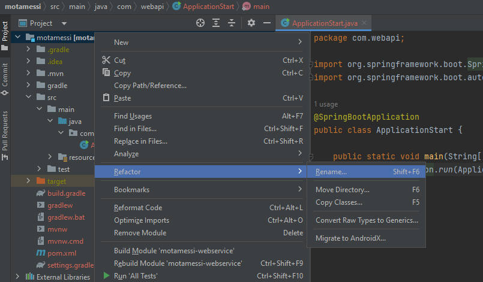
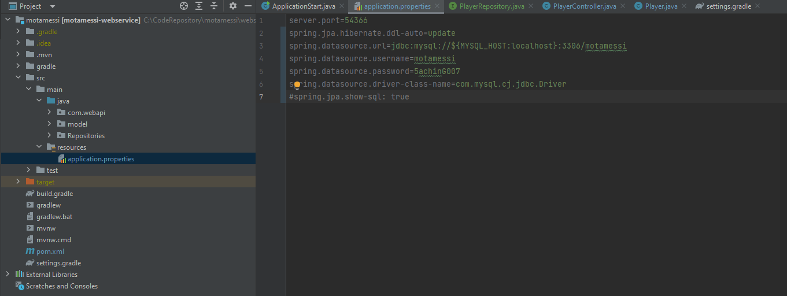

# Set up shorcut keys
>>   
# Setting up string boot rest api app
>>Download spring boot rest api template from https://spring.io/guides/gs/motamessi-webapi/
Extract All, Open intellj and open the mvnw file inside \initial.
If error with getting dependency to go File-->settings-->build execution deployment-->Maven and set the the maven home path to the downloaded and extracted maven template root <br>
  
<br>Oepn application.properties file and add server.port=54366. If that port is in use by other app in you local keep adding one to it until you get a successfull run.
<br>  
<br>To rename module, right click on the project folder
<br>  

# Connecting to mysql database
<br> Add dependency in pom.xml
```xml
<dependency>
    <groupId>mysql</groupId>
    <artifactId>mysql-connector-java</artifactId>
    <scope>runtime</scope>
</dependency>
```
<br>  
# ...