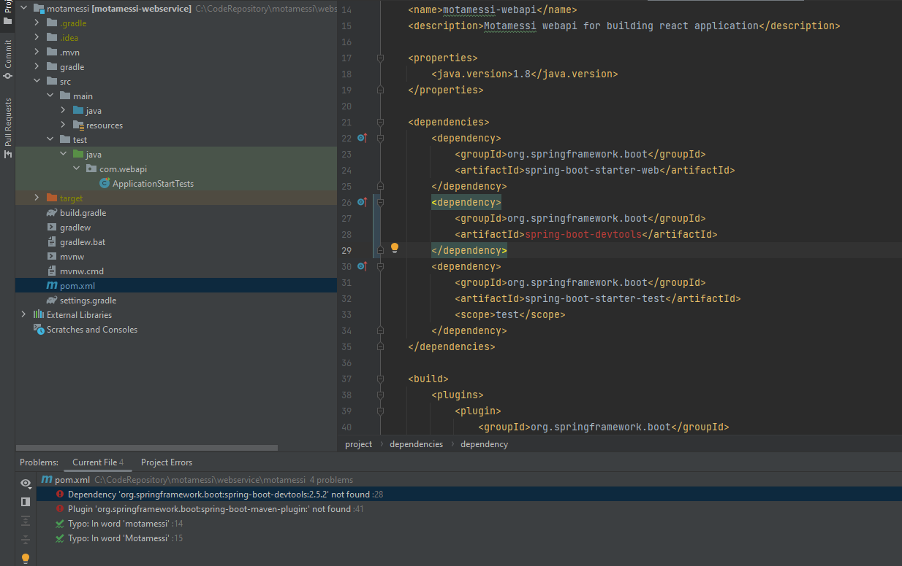

# Setting up string boot rest api app
>>  When running into dependency not found issue
   
 <strong>Solution</strong>
 Go to file menu, close the project and reopen. It will take some time to resolve. 
The plugin issue will go away when <version>${project.parent.version}</version> was added in <plugin> section.
 